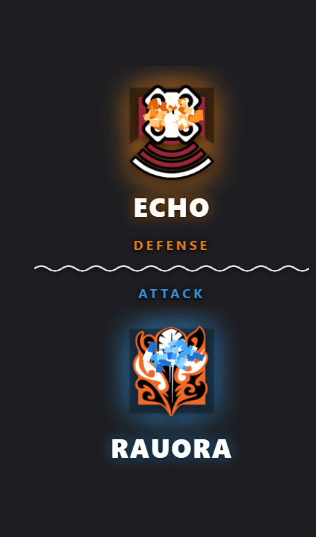

# R6 Operator Randomiser

A "lucky dip" roulette overlay for Rainbow Six Siege streams. Spins through the
operator emblems and lands on exactly one **Attacker** and one **Defender**,
then celebrates with a shake, a pulse and a confetti burst.

Built as a single `index.html` with inline CSS and JS — no build step, no
dependencies, no network access required. Point OBS at the local file and go.

The layout follows `Example.png`: a vertical stack with the Defender on top and
the Attacker below, each reading emblem → name → role label, split by a wavy
divider. The centre text and the background from that reference are gone — the
page renders on full transparency.

## Use it in OBS

1. **Sources → + → Browser**
2. Tick **Local file** and choose `index.html` from this folder.
3. Set **Width 460**, **Height 700** (see [Sizing](#sizing) to change this).
4. Tick **Shutdown source when not visible** and
   **Refresh browser when scene becomes active**.

With those last two boxes ticked, hiding and re-showing the source re-rolls the
operators — so a single OBS hotkey bound to source visibility becomes your
"spin" button. That is the intended stream workflow.

The background is fully transparent, so the overlay composites straight over
your gameplay capture with no keying or blend mode needed.

## Rolling again

| Trigger | Notes |
| --- | --- |
| Page load | Default. This is what the OBS visibility toggle uses. |
| Click | Anywhere on the overlay (needs **Interact**). |
| `Space`, `Enter` or `R` | Needs **Interact**. |
| `window.roll()` | For a custom browser dock or script. |

Re-rolls are ignored while a spin is in progress, so mashing the hotkey will not
desync the two reels.

## Options

Append these to the file URL as a query string, e.g.
`index.html?scale=1.4&spin=6000`.

| Parameter | Default | Description |
| --- | --- | --- |
| `scale` | `1` | Scales the whole overlay. `1.5` = 150%. |
| `spin` | `4200` | Defender reel duration, ms. The Defender lands first. |
| `stagger` | `900` | How much later the Attacker lands, ms. Set `0` to land together. |
| `auto` | `1` | Roll automatically on load. `0` waits for a click or key. |
| `confetti` | `1` | `0` disables the confetti burst. |
| `recruits` | `0` | `1` adds the five legacy Recruit variants to both pools. |
| `fmt` | `svg` | `png` uses the high-resolution PNGs instead of the SVGs. |

SVG is the default because the emblems stay crisp at any `scale` and each file
is roughly 2 KB, so all 76 preload instantly.

### Sizing

At `scale=1` the layout occupies about **400 × 580**. A 460 × 700 browser source
gives it comfortable breathing room. If you change `scale`, multiply the source
dimensions to match — or just leave the source large, since the transparent
margin costs nothing.

The portrait proportions suit a side panel or a vertical stream. For a wider
placement, drop `scale` and let the transparent margin absorb the difference.

## Randomness

Each draw calls `crypto.getRandomValues()` and maps it to the roster with
rejection sampling, which discards the tail of the 32-bit range that would
otherwise make low indices very slightly more likely. Nothing is seeded, stored
or cached between rolls, so a result cannot be predetermined or replayed.

Verified over 380,000 draws: chi-square 34.7 against 37 degrees of freedom,
comfortably uniform.

## Roster

38 Attackers and 38 Defenders, current through **Operation High Stakes**
(Denari). The five legacy Recruit variants are excluded by default, since
Striker and Sentry replaced them in Operation New Blood.

To adjust the roster, edit the `ATTACKERS` and `DEFENDERS` arrays near the top
of the `<script>` block in `index.html`. Each entry is
`["asset-basename", "Display Name"]`, where the basename matches a file in both
asset folders.

## Assets

| Folder | Contents |
| --- | --- |
| `Scalable vector graphic (SVG)/` | 81 emblems, used by default |
| `High-resolution PNG/` | The same 81 emblems as PNGs, used with `?fmt=png` |

Operator emblems are the property of Ubisoft.
